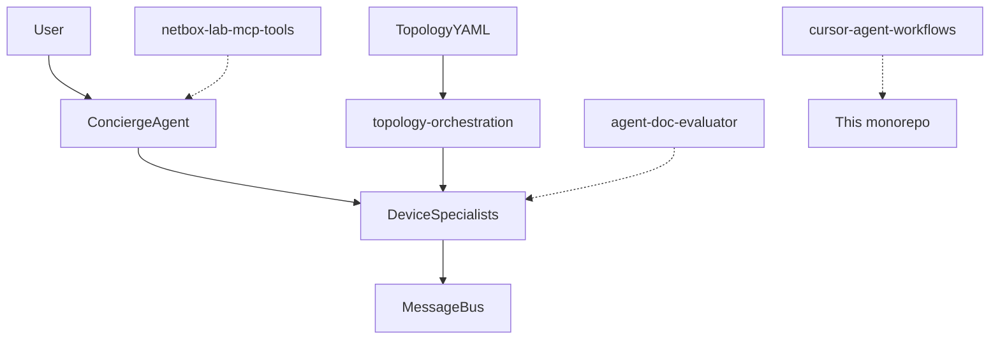

# Multi-Agent Network

Public portfolio of Cursor-built projects for AI-assisted network lab automation: multi-agent device specialists, Velocity topology orchestration, agent evaluation, NetBox MCP tools, and IDE workflow templates.

**Organization:** [testinsightconsulting](https://github.com/testinsightconsulting)

## Projects

| Project | Description |
|---------|-------------|
| [device-agent-mesh](projects/device-agent-mesh/) | Concierge + per-device specialist agents, message bus, RAG, SSH/simulated devices |
| [topology-orchestration](projects/topology-orchestration/) | Parse Spirent Velocity / TOSCA YAML; map `inventory_id` to agents |
| [agent-doc-evaluator](projects/agent-doc-evaluator/) | Rule-based scoring harness for documentation Q&A agents |
| [netbox-lab-mcp-tools](projects/netbox-lab-mcp-tools/) | Reference MCP tools for topology/reservation workflows (mock NetBox) |
| [cursor-agent-workflows](projects/cursor-agent-workflows/) | Cursor IDE skills, hooks, and project scaffold |

## Architecture



## Quick start

```bash
git clone https://github.com/testinsightconsulting/multi-agent-network.git
cd multi-agent-network/projects/device-agent-mesh
uv sync
cp .env.example .env   # add GEMINI_API_KEY
uv run device-agent-mesh --topology config/topology.yaml
```

Inspect an orchestration topology:

```bash
cd ../topology-orchestration
uv sync
uv run topology-orchestration examples/zero_touch_lab.yaml
```

## Cursor history

See [docs/CURSOR_PORTFOLIO.md](docs/CURSOR_PORTFOLIO.md) for how each project maps to real workstreams.

## Related repositories

- [claude-nexus](https://github.com/intisanchez/claude-nexus) — Claude Code master hub (skills, MCP registry, sysadmin)

## License

MIT — see [LICENSE](LICENSE).
